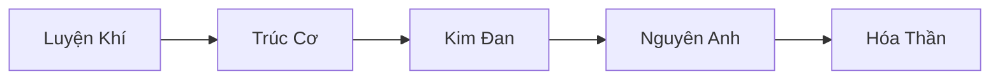
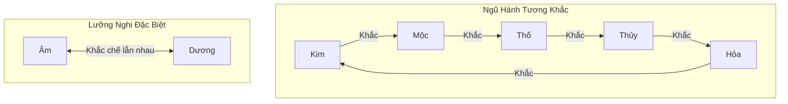
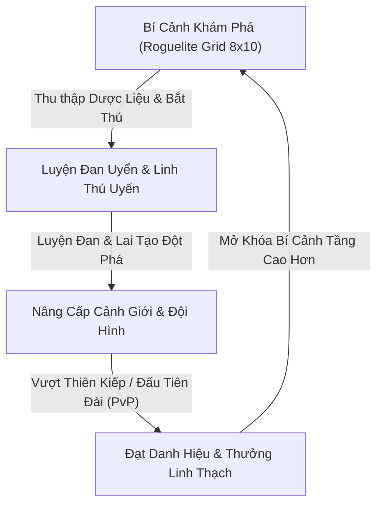

# 🐉 Ngự Thú Tiên Đồ (Beast Ascendant: Cultivation & Taming)

> **Thể loại**: Turn-based Strategy RPG / Monster Taming / Xianxia Cultivation  
> **Nền tảng mục tiêu**: Web-based (HTML5 / WebGL) & Native Client (PC / Mobile)  
> **Công nghệ cốt lõi**: Zig 0.16.0, Sokol Backend, WebGL Standard API Abstraction, Sparse-Set ECS Architecture

---

## 1. Cốt Truyện & Thế Giới Quan (Lore & Universe)

### 1.1. Bối Cảnh: Đại Hoang Cửu Trọng Giới
Vạn năm trước, Chân Long Thủy Tổ vẫn lạc trong trận Hỗn Độn Chi Chiến. Trái tim rồng — **Long Hạch** vỡ vụn thành hàng vạn mảnh tinh thạch tản mác rơi xuống 9 tầng thiên địa của Đại Hoang Giới. Năng lượng Hỗn Độn và nguyên tố nguyên thủy từ Long Hạch ngấm vào muôn loài, biến dị vạn vật thành vô số **Huyền Thú (Linh Thú)** mang thiên phú dị bẩm và sức mạnh Ngũ Hành.

### 1.2. Sứ Mệnh Của Người Chơi
Người chơi khởi đầu là một đệ tử ngoại môn vô danh của một tiểu tông môn (hoặc một Tán tu độc hành). Khác với các tu sĩ truyền thống chỉ chăm chăm rèn luyện nhục thân, bạn lĩnh ngộ được tuyệt học thượng cổ: **Ngự Thú Tu Tiên Quyết**.

Mục tiêu của bạn:
- Tự mình đột phá các đại cảnh giới tu tiên để gia tăng thọ nguyên và linh hồn chi lực.
- Thám hiểm các **Bí Cảnh Khám Phá**, thu phục các kỳ trân dị thú hoang dã bằng **Ngự Thú Lệnh**.
- Lai tạo, bồi dưỡng huyết mạch linh thú nhằm đánh thức sức mạnh Chân Long hoặc Thần Thú Thượng Cổ (Thanh Long, Bạch Hổ, Chu Tước, Huyền Vũ).
- Vượt qua Thiên Kiếp, lật tẩy dã tâm của các đại thế lực Ma đạo đang âm mưu tái hợp Long Hạch để hủy diệt Cửu Trọng Giới.

---

## 2. Hệ Thống Nhân Vật (Player Cultivation System)

Nhân vật chính đóng vai trò là **Ngự Thú Sư (Chủ Nhân / Trận Nhãn)** đứng tại vị trí bảo hộ, thi triển trận pháp và phù chú hỗ trợ cho toàn đội hình linh thú.



### 2.1. Cảnh Giới Tu Luyện (Breakthrough & Tribulation)
- **Các đại cảnh giới**: Luyện Khí $\rightarrow$ Trúc Cơ $\rightarrow$ Kim Đan $\rightarrow$ Nguyên Anh $\rightarrow$ Hóa Thần (mỗi cảnh giới gồm Sơ Kỳ, Trung Kỳ, Hậu Kỳ, Viên Mãn).
- **Điều kiện đột phá**:
  - Tích lũy đủ Linh Khí qua tu luyện và chiến đấu.
  - Sử dụng **Đan Dược Đột Phá** (ví dụ: *Trúc Cơ Đan*, *Tụ Kim Đan*, *Ngưng Anh Đan*) luyện từ linh thảo thu hoạch trong Bí Cảnh.
  - **Độ Thiên Kiếp**: Vượt qua trận chiến sinh tử chống lại Lôi Kiếp Boss để đúc lại căn cốt.
- **Tác dụng của cảnh giới Tu sĩ**:
  - Mở rộng số lượng Linh Thú có thể khế ước.
  - Tăng tỷ lệ thành công khi sử dụng **Ngự Thú Lệnh** bắt quái vật cấp cao.
  - Gia tăng uy áp trận pháp, tăng chỉ số cơ bản cho toàn bộ linh thú xuất chiến.

### 2.2. Pháp Thuật Chủ Nhân (Master Skills)
Tu sĩ không trực tiếp cận chiến nhưng sở hữu các thuật pháp hỗ trợ mang tính lật ngược tình thế:
1. **Hộ Thân Trận**: Tạo kết giới giảm 40% sát thương cho Linh thú tiền phong trong 2 lượt.
2. **Cuồng Bạo Phù**: Cường hóa linh lực, tăng 50% Thân Pháp (Speed) và Công kích trong 2 lượt.
3. **Thanh Tâm Chú**: Giải trừ toàn bộ hiệu ứng khống chế (Choáng, Đốt cháy, Băng phong) cho 1 linh thú.
4. **Thu Phục Thuật**: Tăng tỷ lệ thành công của Ngự Thú Lệnh khi Linh thú mục tiêu suy yếu (HP < 15%).

---

## 3. Hệ Thống Linh Thú (Monster Taming & Breeding)

Linh Thú là trái tim chiến thuật của toàn bộ trò chơi, kết hợp giữa phong cách mỹ thuật Tiên hiệp Cổ phong và cơ chế sưu tập Pokemon sâu sắc.



### 3.1. Thuộc Tính Nguyên Tố (Elemental Affinities)
- **Ngũ Hành**: Kim, Mộc, Thủy, Hỏa, Thổ.
  - **Tương sinh**: Kim $\rightarrow$ Thủy $\rightarrow$ Mộc $\rightarrow$ Hỏa $\rightarrow$ Thổ $\rightarrow$ Kim (kích hoạt combo buff).
  - **Tương khắc**: Sát thương tăng **150%** khi đánh vào hệ bị khắc chế, giảm còn **75%** khi đánh vào hệ kháng.
- **Lưỡng Nghi (Đặc biệt)**: Âm & Dương — gây sát thương chí mạng tương hỗ lẫn nhau.

### 3.2. Phẩm Chất & Huyết Mạch (Rarity & Bloodline)
| Phẩm Chất | Danh Xưng | Số Skill | Giới Hạn Cảnh Giới | Tiến Hóa (Evolution) | Đặc Điểm |
| :--- | :--- | :---: | :---: | :---: | :--- |
| **Hạ Phẩm** | Phàm Thú | 2 | Luyện Khí | Không | Thú thông thường, dễ bắt, nguyên liệu lai tạo sơ cấp |
| **Trung Phẩm** | Yêu Thú | 3 | Trúc Cơ | 1 lần | Có khả năng biến đổi ngoại hình và kích hoạt nội tại hệ |
| **Thượng Phẩm** | Dị Chủng | 4 | Kim Đan / Nguyên Anh | 2 lần | Kháng nguyên tố, sở hữu kỹ năng AOE diện rộng |
| **Cực Phẩm** | Thượng Cổ Thần Thú | 4 + 1 Thiên Phú | Hóa Thần | 3 lần (Thức Tỉnh) | Tứ Linh (Thanh Long, Bạch Hổ, Chu Tước, Huyền Vũ), Thiên phú toàn đội |

### 3.3. Cơ Chế Thu Phục (Taming / Capture System)
- Trong các trận chiến Bí Cảnh, khi Linh Thú hoang dã bị đánh tụt máu xuống **HP < 15%** (Máu Đỏ):
- Người chơi có thể sử dụng **Ngự Thú Lệnh** tương ứng:
  - *Hạ Phẩm Ngự Thú Lệnh*: Dành cho Phàm Thú (tỷ lệ cơ bản 70%).
  - *Huyền Thiết Ngự Thú Lệnh*: Dành cho Yêu Thú (tỷ lệ cơ bản 45%).
  - *Tử Kim Ngự Thú Lệnh*: Dành cho Dị Chủng (tỷ lệ cơ bản 25%).
  - *Hỗn Độn Ngự Thú Lệnh*: Dành cho Thần Thú (bắt buộc kết hợp Thu Phục Thuật).
- Tỷ lệ bắt phụ thuộc vào: `Chênh lệch Cảnh giới Tu sĩ vs Quái` + `Lượng HP còn lại` + `Hiệu ứng bất lợi (Choáng / Ngủ)`.

### 3.4. Lai Tạo & Đột Phá Huyết Mạch (Breeding / Linh Thú Uyển)
- Cho 2 linh thú cùng phân nhánh vào **Linh Thú Uyển** kết hợp đan dược bồi bổ:
- **Tỷ lệ biến dị gen**:
  - Đời con có cơ hội nhận được **Kỹ năng Ẩn** hoặc **Huyết Mạch Thượng Cổ**.
  - Tỷ lệ kế thừa chỉ số cơ bản vượt trội so với bố mẹ.

---

## 4. Hệ Thống Chiến Đấu (Turn-Based Battle System)

### 4.1. Đội Hình Xuất Chiến (Battle Formation)
Đội hình tiêu chuẩn gồm **1 Chủ Nhân (Ngự Thú Sư)** và **5 Linh Thú** (khớp với kiến trúc 6 slot thực thể của hệ thống):
- **Trận Pháp Chính (3 vị trí trên sân)**:
  1. **Tiền Phong (Frontline / Tanker)**: Hút sát thương, sở hữu khiên chắn và chỉ số Thể Phách cao (Thổ/Kim).
  2. **Trung Quân (Midline / DPS)**: Gây sát thương chủ lực đơn mục tiêu hoặc diện rộng (Hỏa/Lôi/Kim).
  3. **Hậu Vệ (Backline / Support & Controller)**: Khống chế, hồi phục máu, giải trừ hiệu ứng (Mộc/Thủy/Âm).
- **Dự Bị (Substitutes - 2 vị trí)**: Tự động bước lên sàn đấu khi một linh thú chính kiệt sức, hoặc đổi chỗ linh hoạt thông qua lượt đi của Tu sĩ.

```
      [Hậu Vệ]       [Trung Quân]       [Tiền Phong]  <--->  [ĐỐI THỦ]
          |                |                  |
      [Hồi/Hỗ Trợ]     [Sát Thương]        [Chống Chịu]
          ^                ^                  ^
          +-------- [TU SĨ CHỦ NHÂN] ---------+
               (Trận Pháp & Pháp Bảo Hỗ Trợ)
```

### 4.2. Thứ Tự Hành Động (Speed / Thân Pháp Engine)
- Mỗi đơn vị trên chiến trường sở hữu chỉ số **Thân Pháp (Speed)**.
- Hệ thống Action Bar tích lũy điểm hành động; đơn vị đạt ngưỡng 1000 điểm Thân Pháp sẽ giành quyền ra đòn.
- Kỹ năng tiêu hao **Linh Lực (Mana)** và có số lượt hồi chiêu (**Cooldown**) nhất định.

### 4.3. Phối Hợp Kích Hoạt Nguyên Tố (Synergy & Combo)
Khi các linh thú có nguyên tố tương sinh ra chiêu trong cùng một vòng:
- **Hỏa + Mộc = Phần Viêm Trận**: Tăng 30% sát thương Hỏa và thiêu đốt lan sang toàn bộ đội hình đối phương.
- **Thủy + Lôi (Kim biến dị) = Vạn Lôi Trận**: Tăng 100% tỷ lệ gây tê liệt (mất lượt).
- **Thổ + Kim = Bàn Thạch Kim Cang Trận**: Miễn nhiễm 1 đòn sát thương chí mạng cho toàn đội.

---

## 5. Vòng Lặp Gameplay Cốt Lõi (Core Loops)



### 5.1. Bí Cảnh Khám Phá (Roguelite Grid 8x10 Map)
- Bản đồ dạng lưới chiến thuật **8 x 10 ô** (`GRID_ROWS = 8`, `GRID_COLS = 10`):
  - **Ô Thảo Dược**: Thu hái Linh chi, Chu quả, Cỏ Đoạn Trường để luyện đan.
  - **Ô Yêu Thú Hoang Dã**: Gặp quái vật ngẫu nhiên; cơ hội đánh suy yếu để dùng Ngự Thú Lệnh bắt thú mới.
  - **Ô Kỳ Ngộ (Random Event)**: Động phủ tiền nhân, bia đá truyền thừa pháp thuật, hoặc cạm bẫy cổ trận.
  - **Ô Thủ Lĩnh / Thiên Kiếp (Boss Node)**: Vượt qua để hoàn thành tầng Bí Cảnh và kích hoạt đột phá cảnh giới.

### 5.2. Luyện Đan & Phù Chú (Alchemy & Crafting)
- Chế biến đan dược tăng kinh nghiệm (*Tụ Khí Đan*), đan dược đột phá (*Trúc Cơ Đan*), đan dược trị thương và các loại bùa chú chiến đấu (*Cuồng Bạo Phù*, *Hộ Thân Phù*).

### 5.3. Đấu Tiên Đài (PvP & Ranked Arena)
- Khiêu chiến trận pháp ngự thú của người chơi khác.
- So tài chiến thuật sắp xếp vị trí Ngũ Hành và kích hoạt Combo nguyên tố.

---

## 6. Kiến Trúc Kỹ Thuật (Technical Architecture)

Dự án được xây dựng với tư duy hiệu năng tối đa, không phụ thuộc framework cồng kềnh, chạy mượt mà trên mọi trình duyệt Web (WASM/WebGL) và Native:

1. **Ngôn ngữ lập trình**: **Zig 0.16.0** (Tối ưu hóa bộ nhớ, kiểm soát chặt chẽ an toàn con trỏ).
2. **Hệ thống Đồ họa WebGL Standard**:
   - Giao diện lập trình chuẩn **WebGL API** (`gl.*`) tại [src/libs/webgl.zig](file:///home/mypc/projects/sprout/src/libs/webgl.zig).
   - Tự động phân tích cú pháp GLSL, căn lề bộ nhớ **std140**, quản lý render pipeline cache thông minh trên nền backend phần cứng **Sokol Gfx** (`sokol.gfx`).
3. **Kiến Trúc Dữ Liệu Sparse-Set ECS**:
   - Module [src/libs/ecs.zig](file:///home/mypc/projects/sprout/src/libs/ecs.zig) cung cấp:
     - `Entity`: Định danh chỉ mục thế hệ (Generational Indexing) chống Use-After-Free.
     - `ComponentPool(T)`: Mảng lưu trữ tuần tự phân cụm dày đặc (Dense storage) tối ưu CPU L1/L2 Cache và SIMD.
     - `MultiView`: Khả năng truy vấn nhiều Component cùng lúc với độ phức tạp cực nhỏ $O(\text{min\_pool})$.